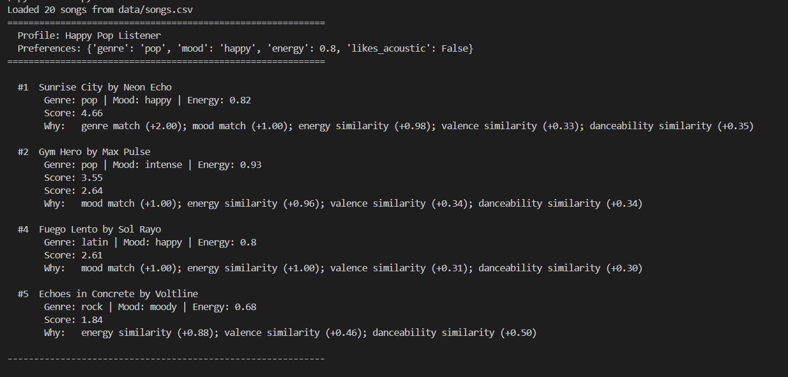

# 🎵 Music Recommender Simulation

## Project Summary

This project is a content-based music recommender built in Python. Unlike collaborative filtering, which relies on behavior from many users to find patterns (like Spotify's "users who liked X also liked Y"), this system works purely by comparing song attributes against a single user's taste profile. Each song in the catalog has features like genre, mood, energy, and danceability. The user provides their preferences, and the system scores every song based on how closely it matches, then returns the top results with explanations for each recommendation. It is designed for classroom exploration, not real-world use.

---

## How The System Works

This recommender uses a content-based filtering approach. It takes a user's taste profile and compares it against every song in a small CSV catalog to find the best matches.
 
Each `Song` carries the following features: genre, mood, energy (0–1), tempo_bpm, valence (0–1), danceability (0–1), and acousticness (0–1). Genre and mood are categorical — they either match the user's preference or they don't. The numerical features allow the system to measure closeness rather than requiring an exact match.
 
A `UserProfile` stores: favorite_genre, favorite_mood, target_energy, and likes_acoustic. These represent the user's ideal "vibe" that every song gets compared against.
 
### Algorithm Recipe
 
Each song is scored against the user's profile using these rules:
 
| Feature | Type | Rule | Max Points |
|---|---|---|---|
| Genre | Categorical | +2.0 if exact match | 2.0 |
| Mood | Categorical | +1.0 if exact match | 1.0 |
| Energy | Numerical | `1.0 - abs(song_energy - user_energy)` | 1.0 |
| Valence | Numerical | `0.5 × (1.0 - abs(song_valence - 0.5))` | 0.5 |
| Danceability | Numerical | `0.5 × (1.0 - abs(song_danceability - 0.5))` | 0.5 |
| Acousticness | Boolean bonus | +0.3 if `likes_acoustic` is True and acousticness > 0.7 | 0.3 |
 
**Maximum possible score: 5.3 points.**
 
Genre carries the most weight because it tends to be the strongest signal of taste — recommending rock to a pop listener is usually a bigger miss than getting the energy slightly wrong. Mood matters but less so. The numerical features (energy, valence, danceability) reward closeness to the user's target rather than just high or low values. The acoustic bonus is a simple flag that lets the system distinguish users who prefer stripped-down, organic sounds.
 
Once every song has a score, the system sorts them from highest to lowest and returns the top K results along with the reasons each song earned its points.
 
### Data Flow
 
**Input** (User Preferences) → **Process** (Loop through every song, score it) → **Output** (Top K ranked recommendations with explanations)
 
See [`recommender_flowchart.md`](recommender_flowchart.md) for the full Mermaid.js diagram.
 
### Expected Biases
 
- **Genre dominance:** Because genre is worth 2.0 out of 5.3 possible points, the system will favor songs in the user's preferred genre even when other genres better match their mood and energy. This creates a filter bubble — users only see more of what they already said they like.
- **Catalog imbalance:** The dataset has more lofi songs (3) than most other genres (1 each). Users who prefer underrepresented genres like jazz or ambient will get fewer strong matches, not because the algorithm is wrong but because the data is thin.
- **Neutral midpoint assumption:** Valence and danceability are scored against a fixed midpoint of 0.5 since the user profile doesn't include targets for those. This slightly penalizes songs at the extremes and favors "middle of the road" tracks.

### CLI Output



---

## Getting Started

### Setup

1. Create a virtual environment (optional but recommended):

   ```bash
   python -m venv .venv
   source .venv/bin/activate      # Mac or Linux
   .venv\Scripts\activate         # Windows

2. Install dependencies

```bash
pip install -r requirements.txt
```

3. Run the app:

```bash
python -m src.main
```

### Running Tests

Run the starter tests with:

```bash
pytest
```

You can add more tests in `tests/test_recommender.py`.

---

## Experiments You Tried

### Weight Shift: Genre Halved, Energy Doubled
 
Changed genre weight from 2.0 to 1.0 and energy weight from 1.0 to 2.0, then re-ran the Classical Energetic edge case profile (classical/energetic/energy 0.9).
 
**Before (original weights):** Winter Sonata (classical/melancholic/energy 0.2) ranked #1 with 3.38 points. The genre match of +2.0 carried it to the top despite a terrible energy score of +0.30.
 
**After (experiment weights):** Winter Sonata dropped to #5 with 2.69 points. Block Party (hip-hop/energetic/energy 0.85) rose to #1 with 3.58. The doubled energy weight meant that songs actually matching the user's desired energy level were properly rewarded.
 
**Takeaway:** The change made recommendations more accurate for edge cases where genre and energy preferences conflict. However, for the standard Happy Pop profile, the original weights already worked well — Sunrise City stayed #1 either way. This suggests the original genre-heavy weighting works for typical users but fails for users with unusual or contradictory preferences.

---

## Limitations and Risks

- The catalog only has 20 songs. With 1–3 tracks per genre, the system runs out of strong matches quickly and starts recommending songs with no categorical connection.
- Genre matching is exact — "indie pop" does not match "pop," and "metal" does not match "rock." Real listeners often enjoy related genres, but the system treats them as completely different.
- The system does not understand lyrics, language, or cultural context. A Spanish-language latin track and an English pop track are compared purely on numerical attributes.
- Genre dominance (2.0 out of 5.3 max points) can override energy and mood preferences entirely, creating a filter bubble where the system keeps recommending the user's stated genre even when the vibe is wrong.
- There is no diversity logic — the top 5 could all be from the same artist or genre with no penalty.

---

## Reflection

Read and complete `model_card.md`:

[**Model Card**](model_card.md)

Building this recommender taught me that the journey from raw data to a recommendation is shorter than I expected — and that's exactly what makes it risky. The entire system boils down to a scoring function that adds up points and sorts. There's no deep understanding of music happening, just pattern matching on numbers. But when the results came back for profiles like the Chill Lofi Studier, the top 5 felt right. That illusion of intelligence from simple math is what real platforms scale up with millions of users and songs, and now I understand why those systems can feel so personalized while still having blind spots.
 
The clearest example of where bias shows up was the weight experiment. By giving genre 2.0 points — the single largest contributor — I accidentally made the system prioritize genre loyalty over actual vibe. A user who said they liked classical but wanted high energy got a slow, sad song instead of an energetic one. That's the same kind of problem real recommender systems face: the design choices engineers make about what to prioritize get baked into every recommendation, and most users never see the math behind it. If I extended this project, I'd add genre similarity (so "metal" and "rock" get partial credit) and a diversity penalty to prevent the top results from being too repetitive.

---

## 7. `model_card_template.md`

Combines reflection and model card framing from the Module 3 guidance. :contentReference[oaicite:2]{index=2}  

```markdown
# 🎧 Model Card - Music Recommender Simulation

## 1. Model Name

Give your recommender a name, for example:

> VibeFinder 1.0

---

## 2. Intended Use

- What is this system trying to do
- Who is it for

Example:

> This model suggests 3 to 5 songs from a small catalog based on a user's preferred genre, mood, and energy level. It is for classroom exploration only, not for real users.

---

## 3. How It Works (Short Explanation)

Describe your scoring logic in plain language.

- What features of each song does it consider
- What information about the user does it use
- How does it turn those into a number

Try to avoid code in this section, treat it like an explanation to a non programmer.

---

## 4. Data

Describe your dataset.

- How many songs are in `data/songs.csv`
- Did you add or remove any songs
- What kinds of genres or moods are represented
- Whose taste does this data mostly reflect

---

## 5. Strengths

Where does your recommender work well

You can think about:
- Situations where the top results "felt right"
- Particular user profiles it served well
- Simplicity or transparency benefits

---

## 6. Limitations and Bias

Where does your recommender struggle

Some prompts:
- Does it ignore some genres or moods
- Does it treat all users as if they have the same taste shape
- Is it biased toward high energy or one genre by default
- How could this be unfair if used in a real product

---

## 7. Evaluation

How did you check your system

Examples:
- You tried multiple user profiles and wrote down whether the results matched your expectations
- You compared your simulation to what a real app like Spotify or YouTube tends to recommend
- You wrote tests for your scoring logic

You do not need a numeric metric, but if you used one, explain what it measures.

---

## 8. Future Work

If you had more time, how would you improve this recommender

Examples:

- Add support for multiple users and "group vibe" recommendations
- Balance diversity of songs instead of always picking the closest match
- Use more features, like tempo ranges or lyric themes

---

## 9. Personal Reflection

A few sentences about what you learned:

- What surprised you about how your system behaved
- How did building this change how you think about real music recommenders
- Where do you think human judgment still matters, even if the model seems "smart"

