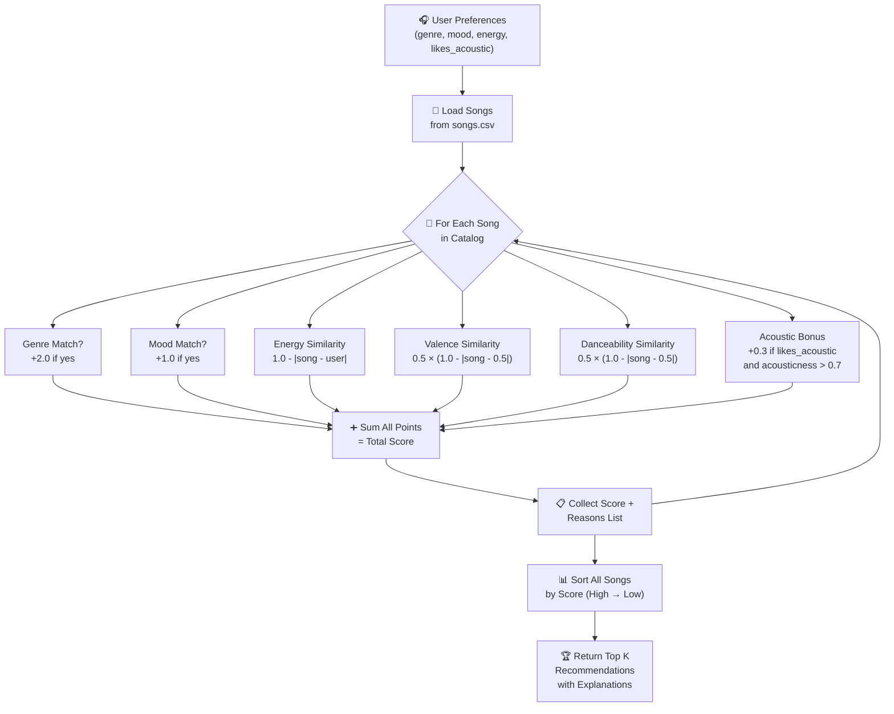

```mermaid
flowchart TD
    A["🎧 User Preferences\n(genre, mood, energy, likes_acoustic)"] --> B["📂 Load Songs\nfrom songs.csv"]
    B --> C{"🔁 For Each Song\nin Catalog"}
    C --> D["Genre Match?\n+2.0 if yes"]
    C --> E["Mood Match?\n+1.0 if yes"]
    C --> F["Energy Similarity\n1.0 - |song - user|"]
    C --> G["Valence Similarity\n0.5 × (1.0 - |song - 0.5|)"]
    C --> H["Danceability Similarity\n0.5 × (1.0 - |song - 0.5|)"]
    C --> I["Acoustic Bonus\n+0.3 if likes_acoustic\nand acousticness > 0.7"]
    D --> J["➕ Sum All Points\n= Total Score"]
    E --> J
    F --> J
    G --> J
    H --> J
    I --> J
    J --> K["📋 Collect Score +\nReasons List"]
    K --> C
    K --> L["📊 Sort All Songs\nby Score (High → Low)"]
    L --> M["🏆 Return Top K\nRecommendations\nwith Explanations"]
```